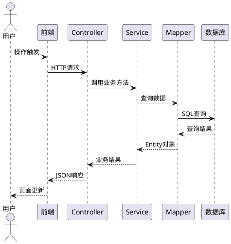
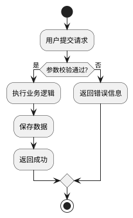

# System Analyzer（系统逆向分析与文档生成器）

## 功能介绍

该 skill 用于通过浏览器截图和源码分析，自动化生成完整的系统设计文档体系，支持以下核心功能：

- **系统页面截图采集**：通过浏览器自动化工具抓取系统各模块页面截图
- **接口抓取与分析**：捕获系统前后端接口请求，分析入参出参和调用关系
- **业务逻辑逆向还原**：结合截图和源码还原系统业务流程和操作逻辑
- **代码架构分析**：分析 Controller→Service→Mapper 分层架构、模块职责和调用关系
- **数据架构梳理**：提取数据库表结构，生成 ER 图和三层架构文档
- **详细设计文档生成**：自动生成业务流程图、时序图、类图、接口文档
- **多格式输出**：Markdown 文档 + PlantUML 图表 + Excel 汇总 + PNG 截图

## 何时调用

当用户需要：
- 分析现有系统的业务逻辑和操作流程
- 梳理代码架构和模块间的调用关系
- 生成系统的详细设计文档
- 整理系统的接口文档（API 文档）
- 制作业务流程图、时序图、架构图
- 从截图+源码反向还原系统设计
- 生成数据架构文档和 ER 图
- 整理系统的完整技术文档体系

## 使用指南

### 基本使用步骤

```
参数确认 → 截图采集 → 接口抓取 → 源码分析 → 文档生成 → 图表生成 → 质量验证
```

### 详细工作流

#### Phase 1: 参数确认与准备

**必需参数**（通过 AskUserQuestion 向用户确认）：

| 参数 | 说明 | 示例 |
|------|------|------|
| 系统访问地址 | 系统的 Web URL | `https://example.com` |
| 登录凭据 | 用户名和密码 | `admin / password123` |
| 源码目录 | 后端项目根目录 | `D:\workspace\project-backend` |
| 前端源码目录（可选） | 前端项目根目录 | `D:\workspace\project-frontend` |
| 系统名称 | 用于文档命名 | `投研一体化系统` |
| 业务模块列表 | 系统的业务模块名称 | `首页,股票池,投研指标,...` |

**可选参数**：

| 参数 | 说明 | 默认值 |
|------|------|--------|
| 截图分辨率 | 浏览器窗口大小 | `1920x1080` |
| 是否抓取接口 | 是否通过 DevTools 抓取 API | 是 |
| 图表格式 | PlantUML / Mermaid | PlantUML |
| 输出目录 | 文档输出路径 | `D:\workspace\summary` |

#### Phase 2: 系统页面截图采集

**2.1 截图策略**

按业务模块逐页截图，每个模块覆盖以下页面类型：
- **列表页**：数据表格、查询条件、筛选器
- **详情页**：表单详情、关联数据
- **编辑页**：新增/编辑表单
- **弹窗/对话框**：确认框、选择器
- **图表页**：仪表盘、统计图表
- **特殊功能页**：审批流程、导入导出

**2.2 截图自动化脚本模板**

```python
"""
系统截图自动化脚本
使用 Playwright / Selenium 逐页截图
"""
import os
from playwright.sync_api import sync_playwright

SCREENSHOT_DIR = "screenshots"

def capture_module_pages(base_url, module_name, pages, credentials):
    """
    pages: [{"name": "页面名称", "url": "/path", "actions": [...]}]
    actions: [{"type": "click", "selector": ".btn"}, {"type": "wait", "ms": 1000}]
    """
    with sync_playwright() as p:
        browser = p.chromium.launch(headless=False)
        context = browser.new_context(viewport={"width": 1920, "height": 1080})
        page = context.new_page()

        # 登录
        page.goto(f"{base_url}/login")
        page.fill("#username", credentials["username"])
        page.fill("#password", credentials["password"])
        page.click("#login-btn")
        page.wait_for_load_state("networkidle")

        # 逐页截图
        module_dir = os.path.join(SCREENSHOT_DIR, module_name)
        os.makedirs(module_dir, exist_ok=True)

        for page_info in pages:
            page.goto(f"{base_url}{page_info['url']}")
            page.wait_for_load_state("networkidle")

            # 执行页面操作
            for action in page_info.get("actions", []):
                if action["type"] == "click":
                    page.click(action["selector"])
                    page.wait_for_timeout(500)
                elif action["type"] == "wait":
                    page.wait_for_timeout(action["ms"])

            # 截图
            filename = f"{page_info['name']}.png"
            page.screenshot(path=os.path.join(module_dir, filename), full_page=True)

        browser.close()
```

**2.3 截图命名规范**

```
screenshots/
  ├── 01-首页/
  │   ├── 01-Dashboard仪表盘.png
  │   ├── 02-我的待办.png
  │   └── 03-日程管理.png
  ├── 02-股票池/
  │   ├── 01-股票池列表.png
  │   ├── 02-新增股票.png
  │   └── 03-池分析.png
  └── ...
```

命名规则：`{序号}-{页面功能描述}.png`

**输出**：`screenshots/{模块名}/` 目录下的 PNG 文件

#### Phase 3: 接口抓取与分析

**3.1 接口抓取方式**

通过浏览器 DevTools Protocol 或网络代理抓取接口：

```python
"""
接口抓取脚本 - 使用 Playwright 监听网络请求
"""
def capture_apis(base_url, module_pages, credentials):
    """
    遍历模块页面，抓取所有 API 请求
    """
    apis = []
    with sync_playwright() as p:
        browser = p.chromium.launch(headless=False)
        context = browser.new_context()
        page = context.new_page()

        # 监听所有网络请求
        def on_request(request):
            if request.resource_type == "xhr" or request.resource_type == "fetch":
                apis.append({
                    "url": request.url,
                    "method": request.method,
                    "headers": dict(request.headers),
                    "post_data": request.post_data,
                })

        def on_response(response):
            if response.request.resource_type in ("xhr", "fetch"):
                # 匹配对应的请求并记录响应
                pass

        page.on("request", on_request)
        page.on("response", on_response)

        # 登录并遍历页面（同 Phase 2）
        # ...

    return apis
```

**3.2 接口文档生成模板**

对每个模块生成接口文档，格式如下：

```markdown
## {接口名称}

- **URL**: `{HTTP方法} {路径}`
- **Controller**: `{Controller类名}`
- **方法**: `{Java方法名}`
- **说明**: {接口功能描述}

### 请求参数

| 参数名 | 类型 | 必填 | 说明 |
|--------|------|------|------|
| id | Long | 是 | 主键ID |
| name | String | 否 | 名称 |

### 响应结果

```json
{
  "code": 200,
  "message": "success",
  "data": { ... }
}
```

### 业务逻辑

1. 接收请求参数
2. 调用 Service 层方法
3. 执行业务逻辑
4. 返回结果
```

**3.3 从源码提取接口信息**

扫描 Controller 类，提取接口定义：

```python
# 关键正则
CONTROLLER_CLASS = r'@RestController|@Controller'
REQUEST_MAPPING = r'@(GetMapping|PostMapping|PutMapping|DeleteMapping|RequestMapping)\("([^"]+)"\)'
METHOD_SIGNATURE = r'public\s+(\w+)\s+(\w+)\s*\(([^)]*)\)'
APIModelProperty = r'@ApiModelProperty\("([^"]+)"\)'
PARAM_ANNOTATION = r'@(RequestParam|PathVariable|RequestBody)\s*(?:\(\s*value\s*=\s*"([^"]*)"\s*\))?\s*(\w+)\s+(\w+)'
```

**输出**：
- `{模块名}接口实现.md` — 每个模块的接口文档
- `00-API总索引.md` — 全部接口的汇总索引
- `all_apis.csv` — 全部 API 的 CSV 汇总表

#### Phase 4: 源码架构分析

**4.1 项目结构分析**

扫描项目目录，识别技术栈和分层架构：

```
project-backend/
  ├── src/main/java/com/example/
  │   ├── controller/     # 控制层 - 接口定义
  │   ├── service/        # 业务层 - 业务逻辑
  │   │   └── impl/       # 业务实现
  │   ├── mapper/         # 持久层 - 数据访问
  │   ├── entity/         # 实体类 - 数据模型
  │   ├── dto/            # 数据传输对象
  │   ├── vo/             # 视图对象
  │   ├── config/         # 配置类
  │   ├── common/         # 公共工具
  │   └── utils/          # 工具类
  ├── src/main/resources/
  │   ├── mapper/         # MyBatis XML
  │   └── application.yml # 配置文件
  └── pom.xml             # 依赖管理
```

**4.2 模块职责分析**

分析各模块（Maven 子模块或包）的职责：

```python
def analyze_module_responsibilities(project_root):
    """
    分析每个模块的职责：
    1. 扫描 pom.xml 获取模块名和依赖
    2. 统计 controller/service/mapper 数量
    3. 提取模块描述（从 README 或 package-info.java）
    """
```

**4.3 调用关系分析**

建立 Controller→Service→Mapper 的完整调用链：

```python
def analyze_call_chain(project_root):
    """
    1. 扫描 Controller 中的 @Autowired 注入
    2. 追踪 Service 接口 → ServiceImpl 实现
    3. 追踪 ServiceImpl 中的 Mapper 注入
    4. 建立 Controller → Service → Mapper → Table 映射
    """
```

**输出**：
- `01-整体业务逻辑.md` — 系统业务领域划分和整体逻辑
- `02-技术架构与分层设计.md` — 技术栈和架构设计
- `03-代码模块职责与调用关系.md` — 模块职责和调用关系

#### Phase 5: 核心业务逻辑分析

**5.1 代码逻辑逐行拆解**

对核心业务模块进行深度代码分析：

```python
def analyze_core_logic(service_impl_files):
    """
    对每个核心 ServiceImpl:
    1. 提取所有 public 方法
    2. 分析方法调用链
    3. 识别业务规则和条件分支
    4. 提取关键算法和计算逻辑
    5. 标注数据流转路径
    """
```

**5.2 数据流分析**

分析系统数据从输入到存储的完整流转路径：

```
外部数据源 → ETL/导入 → 业务层处理 → 数据库存储 → 前端展示
     ↓              ↓            ↓              ↓
  行情数据      数据清洗      业务规则      缓存/索引
  财务数据      格式转换      计算指标      查询优化
  宏观数据      质量校验      风控规则      权限过滤
```

**输出**：
- `04-核心关键逻辑逐行拆解.md` — 核心代码逻辑分析
- `05-数据流与入参出参说明.md` — 数据流和接口参数

#### Phase 6: 图表生成

**6.1 图表类型与用途**

| 图表类型 | 格式 | 用途 |
|---------|------|------|
| 架构总览图 | PlantUML Component Diagram | 系统整体架构和模块关系 |
| 模块架构图 | PlantUML Component Diagram | 单个模块的内部组件关系 |
| 类图 | PlantUML Class Diagram | 核心类的属性、方法和关系 |
| ER 图 | PlantUML ER Diagram | 数据库表关系 |
| 流程图 | PlantUML Activity Diagram | 业务操作流程 |
| 时序图 | PlantUML Sequence Diagram | 接口调用时序 |
| 状态图 | PlantUML State Diagram | 审批/订单等状态流转 |

**6.2 PlantUML 模板**

**架构总览图**：
```plantuml
@startuml {模块名}-架构总览
!define COMPONENT_COLOR #E8F5E9
skinparam componentStyle uml2

package "前端" {
    [Vue.js 前端] as FE
}

package "网关层" {
    [Spring Cloud Gateway] as GW
}

package "业务服务层" {
    [模块A服务] as SA
    [模块B服务] as SB
}

package "数据层" {
    [MySQL/达梦] as DB
    [Redis] as CACHE
}

FE --> GW --> SA
FE --> GW --> SB
SA --> DB
SA --> CACHE
SB --> DB
@enduml
```

**接口时序图**：


**业务流程图**：


**6.3 图表生成脚本**

```python
"""
PlantUML 图表批量生成脚本
"""
import subprocess
import os

PLANTUML_JAR = "plantuml.jar"
DIAGRAM_DIR = "diagrams"

def generate_diagram(puml_file, output_format="html"):
    """使用 PlantUML CLI 生成图表"""
    cmd = f"java -jar {PLANTUML_JAR} -t{output_format} {puml_file}"
    subprocess.run(cmd, shell=True, check=True)

def batch_generate(diagram_dir):
    """批量生成所有图表"""
    for puml_file in pathlib.Path(diagram_dir).glob("**/*.puml"):
        generate_diagram(puml_file)
```

**输出**：`diagrams/{模块编号}-{图表名}.puml` + `.html`

#### Phase 7: 文档整合与质量验证

**7.1 文档体系结构**

```
summary/
├── 00-API总索引.md                    # API 汇总索引
├── 01-整体业务逻辑.md                  # 系统业务领域划分
├── 02-技术架构与分层设计.md             # 技术栈和架构设计
├── 03-代码模块职责与调用关系.md         # 模块职责和调用关系
├── 04-核心关键逻辑逐行拆解.md           # 核心代码逻辑分析
├── 05-数据流与入参出参说明.md           # 数据流和接口参数
├── 06-架构优缺点及优化建议.md           # 架构评估
├── 07-{模块A}接口实现.md               # 模块A 接口文档
├── 08-{模块B}接口实现.md               # 模块B 接口文档
├── ...
├── screenshots/                        # 系统截图
│   ├── 01-首页/
│   ├── 02-股票池/
│   └── ...
├── diagrams/                           # PlantUML 图表
│   ├── 07-首页-架构总览.puml + .html
│   ├── 07-首页-类图.puml + .html
│   └── ...
├── database_dictionary/                # 数据字典（配合 db-dictionary skill）
└── tools/                              # 辅助脚本
    ├── all_apis.csv
    ├── parse_controllers.py
    └── diagram_gen.py
```

**7.2 质量验证检查项**

| 检查项 | 合格标准 |
|--------|----------|
| 截图覆盖率 | 每个模块至少 2 张截图 |
| 接口文档完整性 | 每个 Controller 的接口都有文档 |
| 图表覆盖率 | 每个模块至少有架构图 + 时序图 |
| 业务逻辑完整性 | 核心流程都有流程图描述 |
| 数据架构完整性 | 核心表都有 ER 图 |
| 文档交叉引用 | 文档间有正确的链接引用 |

**7.3 架构评估维度**

对系统架构进行多维度评估：

| 维度 | 评估内容 |
|------|----------|
| 分层设计 | Controller/Service/Mapper 分层是否清晰 |
| 模块化 | 模块间耦合度、职责是否单一 |
| 数据库设计 | 表结构规范性、索引设计、数据冗余 |
| 接口设计 | RESTful 规范、入参出参一致性 |
| 安全性 | 认证授权、数据权限、SQL 注入防护 |
| 性能 | 缓存策略、查询优化、异步处理 |
| 可维护性 | 代码规范、注释覆盖、日志记录 |

**输出**：`06-架构优缺点及优化建议.md`

## 示例场景

### 示例1：完整系统分析（截图+源码）

**用户请求**：
```
请分析我们的投研一体化系统，系统地址是 https://example.com，
源码在 D:\workspace\project-backend，帮我生成完整的详细设计文档
```

**处理步骤**：
1. 确认系统地址、登录凭据、源码目录、模块列表
2. 使用 Playwright 自动截图 13 个模块共 80+ 张页面截图
3. 通过 DevTools Protocol 抓取 1800+ 个 API 接口
4. 分析源码：Controller→Service→Mapper 调用链
5. 逐模块生成接口文档（13 份）+ API 总索引
6. 生成系统分析文档（6 份）：业务逻辑、技术架构、模块职责、核心逻辑、数据流、架构评估
7. 生成 PlantUML 图表 200+ 张：架构图、类图、流程图、时序图、ER 图
8. 质量验证并输出完整文档体系

### 示例2：仅从源码生成（无系统访问权限）

**用户请求**：
```
我没有系统的访问权限，但可以提供源码，帮我分析代码架构和业务逻辑
```

**处理步骤**：
1. 跳过 Phase 2（截图采集）和 Phase 3（接口抓取）
2. 仅通过源码分析生成文档：
   - 从 Controller 注解提取接口定义
   - 从 ServiceImpl 分析业务逻辑
   - 从 Mapper XML 分析数据访问
3. 图表基于代码结构生成（无截图参考）
4. 接口文档基于代码注解生成

### 示例3：仅从截图分析（无源码）

**用户请求**：
```
只有系统截图，没有源码，帮我整理系统的页面功能和业务流程
```

**处理步骤**：
1. 分析截图中的页面布局、表单字段、按钮操作
2. 根据页面元素推断业务功能和数据流
3. 生成页面功能清单和操作流程图
4. 文档中标注"基于截图推断，建议结合源码验证"

## 技术实现

### 核心技术栈

| 组件 | 技术 | 用途 |
|------|------|------|
| 浏览器自动化 | Playwright / Selenium | 页面截图、接口抓取 |
| 接口抓取 | DevTools Protocol / mitmproxy | HTTP 请求拦截和分析 |
| 源码分析 | 正则表达式 + AST 解析 | 提取注解、方法签名、调用关系 |
| 图表生成 | PlantUML / Mermaid | 流程图、时序图、架构图、ER 图 |
| 文档生成 | Markdown + Jinja2 模板 | 结构化文档输出 |
| 数据分析 | openpyxl / pandas | API 汇总表、素材清单 |

### 关键 Python 依赖

```
playwright>=1.40
plantuml
openpyxl>=3.0
jinja2>=3.0
```

### 与其他 Skill 的协作

| 协作 Skill | 协作方式 |
|-----------|---------|
| `db-dictionary` | 调用数据库字典生成能力，补充数据架构文档 |
| `docx` | 将 Markdown 文档转换为 Word 格式 |
| `pptx` | 基于分析结果生成汇报 PPT |

## 输出文件清单

| 文件 | 格式 | 说明 |
|------|------|------|
| `00-API总索引.md` | Markdown | 全部接口汇总索引 |
| `01-整体业务逻辑.md` | Markdown | 系统业务领域划分 |
| `02-技术架构与分层设计.md` | Markdown | 技术栈和架构设计 |
| `03-代码模块职责与调用关系.md` | Markdown | 模块职责和调用关系 |
| `04-核心关键逻辑逐行拆解.md` | Markdown | 核心代码逻辑分析 |
| `05-数据流与入参出参说明.md` | Markdown | 数据流和接口参数 |
| `06-架构优缺点及优化建议.md` | Markdown | 架构评估 |
| `07-{模块}接口实现.md` | Markdown | 各模块接口文档 |
| `screenshots/` | PNG | 系统页面截图 |
| `diagrams/` | PUML + HTML | PlantUML 图表 |
| `tools/all_apis.csv` | CSV | API 汇总表 |
| `tools/parse_controllers.py` | Python | Controller 解析脚本 |
| `tools/diagram_gen.py` | Python | 图表生成脚本 |

## 注意事项

1. **登录安全**：系统凭据仅在内存中使用，不写入磁盘文件
2. **截图一致性**：使用固定的浏览器窗口大小（1920x1080），确保截图风格统一
3. **接口过滤**：抓取接口时过滤静态资源请求（.js/.css/.png等），只保留 XHR/Fetch 请求
4. **源码编码**：确保使用 UTF-8 编码读取源码文件，避免中文注释乱码
5. **大项目处理**：对于超过 1000 个 Controller 的项目，分模块并行分析
6. **图表渲染**：PlantUML 需要 Java 环境，也可使用在线渲染服务作为备选
7. **文档版本**：建议在文档中标注生成时间，便于后续对比更新
8. **截图隐私**：截图可能包含敏感业务数据，注意脱敏处理
