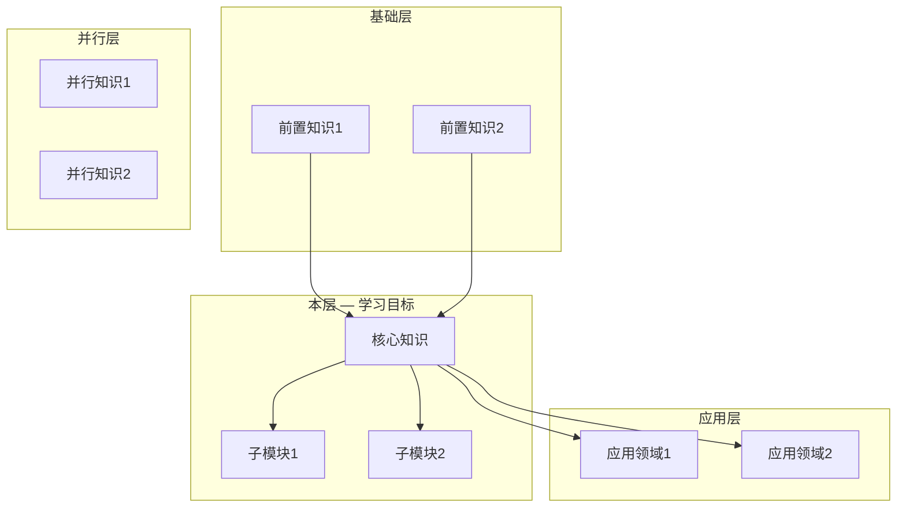

# Knowledge Positioning (知识定位)

> Stage ⓪ of the Eight-Stage Learning Cycle. This reference guides the process of positioning any knowledge within its broader ecosystem before learning begins.

## Why Positioning Matters

Learning without positioning is like navigating without a map — you might reach a destination, but you won't know where you are relative to everything else, and you'll likely waste time on wrong turns.

Two problems positioning prevents:
1. **Blind deep-diving** — spending hours on a detail that has low weight in the overall knowledge structure
2. **Missing foundations** — jumping into advanced content without prerequisites, causing constant friction

## The Four-Layer Knowledge Map

For any subject, build a four-layer map:

### Layer 1: Upper Layer (应用层) — What does this knowledge serve?

Identify the application domains that this knowledge directly enables. This answers "why learn this?" and provides motivation.

Questions to answer:
- What can I build/do after learning this?
- What higher-level skills depend on this knowledge?
- What industries or roles value this knowledge?

Example (for NumPy):
- Machine Learning (scikit-learn, PyTorch)
- Data Visualization (Matplotlib, Plotly)
- Scientific Computing (SciPy)
- Quantitative Finance

### Layer 2: Current Layer (本层) — What is the internal structure?

Decompose the knowledge itself into its major components. This is the skeleton for Stage ② (Decomposition).

Questions to answer:
- What are the major sub-topics within this knowledge?
- How do these sub-topics relate to each other?
- What is the core mental model that holds it all together?

Example (for NumPy):
- ndarray (memory model, strides, shape)
- Data types (dtypes, casting)
- Indexing (basic, fancy, boolean)
- Broadcasting
- Vectorization (ufuncs)
- Memory management (views vs copies)

### Layer 3: Lower Layer (基础层) — What prerequisites are needed?

Identify the foundational knowledge that must be in place before learning this subject. This determines whether the learner is ready.

Questions to answer:
- What knowledge is absolutely required before starting?
- What knowledge is helpful but not strictly required?
- Are there any common prerequisite gaps that cause learners to struggle?

Example (for NumPy):
- Required: Python basics (lists, dicts, functions)
- Required: Basic linear algebra (vectors, matrices)
- Helpful: Basic statistics (mean, variance)
- Helpful: Command line / Git basics

### Layer 4: Parallel Layer (并行层) — What can be learned simultaneously?

Identify knowledge that can be learned alongside this subject, either because it reinforces understanding or because it's commonly used together.

Questions to answer:
- What skills are commonly used alongside this knowledge?
- What complementary skills would accelerate practical application?
- Are there conceptual overlaps that make parallel learning efficient?

Example (for NumPy):
- SQL (relational data concepts overlap with array operations)
- Matplotlib (visualizing array data reinforces understanding)
- Jupyter Notebook (interactive experimentation environment)

## Research Methodology

### When to Use Web Search

Always use WebSearch for knowledge positioning, especially when:
- The field is fast-evolving (technology, frameworks, tools)
- You're unsure about the current state of the ecosystem
- The knowledge is outside your training data's recency
- The user's specific subfield might have changed recently

### Search Queries to Use

Run these searches (in both the user's language and English):

1. **Ecosystem mapping**: `"[subject] ecosystem [year]"` or `"[subject] landscape overview"`
2. **Prerequisites**: `"[subject] prerequisites" ` or `"what to learn before [subject]"`
3. **Learning path**: `"best way to learn [subject] [year]"` or `"[subject] learning roadmap"`
4. **Common pitfalls**: `"[subject] common mistakes beginners"` or `"[subject] misconceptions"`
5. **Alternatives**: `"[subject] alternatives comparison"` or `"[subject] vs [competitor]"`

### Cross-Validation

- Confirm ecosystem claims with at least 2 independent sources
- Verify that mentioned tools/frameworks are still actively maintained
- Check version numbers and release dates for technology subjects
- Look for recent (within 12 months) community discussions about learning paths

## Output Template

The knowledge map should be produced as a visual diagram. Use one of these formats:

### Option A: Inline SVG (preferred for HTML reports)

A layered diagram with:
- Top layer: Application domains (boxes)
- Middle layer: The subject itself with its internal components
- Bottom layer: Prerequisites
- Side layer: Parallel topics
- Arrows showing dependencies (top depends on middle, middle depends on bottom)

### Option B: Mermaid Diagram



### Option C: Text-based Summary (for simple subjects)

If the subject is simple enough that a visual diagram is overkill, use a structured text summary:

```
学习目标：[subject]
├── 应用方向：[what you can do after learning]
├── 内部结构：[major sub-topics]
├── 前置知识：[prerequisites]
└── 并行推荐：[parallel topics]
```

## Quality Gates for Knowledge Positioning

Before moving to Stage ①, verify:
- [ ] The four layers are all identified and populated
- [ ] Prerequisites are distinguished as "required" vs "helpful"
- [ ] Application domains are concrete (not vague like "programming")
- [ ] Internal structure captures the major components (not an exhaustive list)
- [ ] For fast-evolving fields, information is verified via web search
- [ ] The map is visualized (diagram or structured text)

## Positioning Summary Statement

After building the map, write a one-paragraph positioning summary that answers:
1. What is this knowledge? (one sentence)
2. Where does it sit in the broader ecosystem? (which layer of what field)
3. What does it depend on? (prerequisites)
4. What does it enable? (downstream applications)
5. What's the recommended learning approach? (linear, parallel with X, project-driven, etc.)

This summary becomes the opening of the learning guide, giving the learner immediate context before diving into details.
