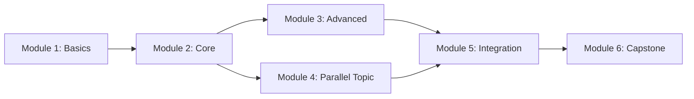

# Learning Methodology (学习方法论)

> Stages ①-⑥ of the Eight-Stage Learning Cycle. This reference provides detailed methodology, templates, and quality criteria for each learning stage.

---

## Stage ①: Self-Assessment (定位评估)

### Purpose

Determine the learner's current level to calibrate the learning path. Learning at the right difficulty (ZPD — Zone of Proximal Development) is the single biggest factor in learning efficiency.

### Diagnostic Design

Create a 5-10 question diagnostic with increasing difficulty:

| Question # | Difficulty | Tests | Example Format |
|------------|-----------|-------|----------------|
| 1-2 | Entry | Basic vocabulary awareness | "What does [concept] mean?" |
| 3-4 | Foundation | Core concept understanding | "Explain why [X] works the way it does" |
| 5-6 | Intermediate | Practical application | "Given [scenario], what would happen if [action]?" |
| 7-8 | Advanced | Edge cases / debugging | "Why does [unexpected behavior] occur?" |
| 9-10 | Expert | System design / optimization | "How would you architect [system]?" |

### Scoring & Placement

| Score | Level | Recommended Action |
|-------|-------|--------------------|
| 0-30% | Beginner | Start from Module 1, fill prerequisite gaps first |
| 30-60% | Intermediate | Review weak modules, start from first unknown module |
| 60-80% | Advanced | Focus on integration and advanced topics, skim basics |
| 80-100% | Expert | Go directly to extension paths, consider teaching others |

### When to Skip the Diagnostic

Skip the formal diagnostic and state an assumed level when:
- The user explicitly states their level ("I'm a beginner at X")
- The context makes it obvious (e.g., asking basic questions)
- The subject is narrow enough that level doesn't significantly change the approach

### Bloom's Taxonomy Target Setting

For each module, assign a target Bloom's level based on the user's goal:

| User Goal | Default Bloom Target | Implication |
|-----------|---------------------|-------------|
| "能用就行" (practical) | Apply | Can use the knowledge to solve problems |
| "想深入理解" (deep) | Analyze | Can explain why and break down components |
| "要精通" (mastery) | Evaluate/Create | Can critique, optimize, and build new things |

---

## Stage ②: Decomposition & Planning (拆解规划)

### Purpose

Break the knowledge into learnable modules with clear dependencies and sequence.

### Module Identification

For each module, define:

```
Module: [name]
Objective: [what the learner will be able to do after this module]
Bloom Target: [Remember/Understand/Apply/Analyze/Evaluate/Create]
Prerequisites: [which modules must come first]
Estimated Time: [hours/sessions]
Key Concepts: [3-5 core concepts within this module]
```

### Dependency Graph

Create a dependency graph showing:
- **Sequential dependencies**: Module B requires Module A (A → B)
- **Parallel modules**: Modules that can be learned in any order or simultaneously
- **Optional modules**: Not required for the core path, but enrich understanding

Visualize as a directed graph (Mermaid or SVG):



### Time Estimation Guidelines

| Module Complexity | Estimated Time | Indicators |
|-------------------|---------------|------------|
| Introductory concept | 1-2 hours | Single mental model, few edge cases |
| Core skill | 3-5 hours | Multiple sub-skills, requires practice |
| Complex system | 5-10 hours | Many interacting parts, edge cases, debugging skills |
| Integration/capstone | 5-15 hours | Combines multiple modules, open-ended |

### Learning Path Output

The learning path should include:
1. A visual dependency graph
2. A numbered sequence with estimated time per module
3. Milestone markers (what the learner can do after each group of modules)
4. Parallel learning recommendations (if applicable)

---

## Stage ③: Deep Understanding (深度理解) — CORE DELIVERABLE

### Purpose

Produce the actual learning content for each module. This is the heart of the learning guide.

### Content Structure per Module

Each module's content should follow this structure:

#### 1. Learning Objectives
- 2-4 specific, measurable objectives
- State the Bloom's level target
- Format: "After this module, you will be able to [specific action]"

#### 2. Core Explanation
- Start with the "why" before the "what" — motivation first
- Explain the underlying principle or design rationale
- Use the **first principles** approach: keep asking "why" until you hit a fundamental truth
- Length: proportional to module complexity, not padded

#### 3. Visual Explanation
Every module MUST include at least one visual element:
- **Architecture/structure** → SVG diagram or Mermaid
- **Process/flow** → Flowchart or step diagram
- **Comparison** → Side-by-side table or visual comparison
- **Data relationships** → Chart or graph
- **Mental model** → Analogy diagram

For inline visuals in conversation, use the `dynamic-ui` skill (PureShowWidget).
For visuals in HTML reports, use inline SVG or Mermaid.

#### 4. Concrete Examples
- Provide 2-3 worked examples per concept
- Show the input, process, and output clearly
- For code: include runnable snippets with expected output
- For concepts: use real-world analogies

#### 5. Common Misconceptions
- List 2-3 things people typically get wrong
- Explain WHY they're wrong (not just "this is wrong")
- Provide the correct understanding

#### 6. Feynman Check
End each module with a "explain it back" prompt:
- "Can you explain [concept] to someone who doesn't know this field?"
- "If you can't articulate it simply, you haven't understood it yet — review the [specific section]"

### Explanation Quality Criteria

| Criterion | What it means | Anti-pattern |
|-----------|---------------|--------------|
| Depth | Explains WHY, not just WHAT | Only listing facts without rationale |
| Clarity | A non-expert can follow the logic | Jargon without explanation |
| Visual support | Concepts have visual representation | Text-only walls |
| Concrete | Uses real examples, not abstractions only | Pure theory without application |
| Honest | Acknowledges complexity and edge cases | Oversimplifying to the point of misinformation |

### Analogy Construction

Good analogies are powerful but bad analogies mislead. Rules:
- Map the analogy to the concept explicitly (which part of the analogy = which part of the concept?)
- State where the analogy breaks down (no analogy is perfect)
- Prefer analogies from domains the user already knows
- Avoid analogies that introduce their own complexity

---

## Stage ④: Deliberate Practice (刻意练习)

### Purpose

Design exercises that transform understanding into skill through targeted, feedback-driven practice.

### Exercise Design Principles

1. **Specific goals**: Not "practice indexing" but "predict the output of these 5 indexing operations"
2. **Immediate feedback**: Include solutions that can be checked right away
3. **Isolated difficulty**: Each exercise tests ONE concept, not multiple
4. **Progressive complexity**: Within each tier, exercises increase in difficulty

### Three-Tier Difficulty Model

#### Tier 1: Basic Verification (基础验证)
- **Purpose**: Confirm the learner understood the core concept
- **Format**: Direct application of the concept in its simplest form
- **Count**: 3-5 exercises per module
- **Example**: "Create an array with shape (3,4) and dtype float64"

#### Tier 2: Comprehensive Application (综合应用)
- **Purpose**: Combine 2-3 concepts from this module
- **Format**: Multi-step problem requiring several concepts
- **Count**: 2-3 exercises per module
- **Example**: "Given a 2D array, extract every other row, reverse column order, and compute row means"

#### Tier 3: Challenge Extension (挑战延伸)
- **Purpose**: Stretch beyond comfort zone, connect to adjacent modules
- **Format**: Open-ended or edge-case problems
- **Count**: 1-2 exercises per module
- **Example**: "Implement a custom ufunc that operates on a 3D array with broadcasting rules"

### Solution Design

- Provide complete solutions, not just answers
- Explain the reasoning, not just the steps
- For code: show alternative approaches and discuss trade-offs
- Mark which concept each step of the solution demonstrates

### Weakness Targeting

For each module, identify the 2-3 most common stumbling points and design at least one exercise specifically targeting each:

| Module Type | Common Stumbling Points | Exercise Strategy |
|-------------|------------------------|-------------------|
| Spatial/structural | Misunderstanding memory layout | "Draw the memory layout" exercises |
| Procedural | Off-by-one errors, order of operations | "Predict the output" exercises |
| Conceptual | Confusing related concepts | "Compare and contrast" exercises |
| Mathematical | Intuition gaps | "Build up from simple case" exercises |

---

## Stage ⑤: Integration & Creation (整合创造)

### Purpose

Design a capstone project that requires combining multiple modules to solve a realistic problem.

### Capstone Project Design

The project should meet ALL of these criteria:

1. **Multi-module**: Requires knowledge from at least 3 modules
2. **Realistic**: Solves a problem someone might actually face
3. **Verifiable**: Has clear success criteria (not subjective)
4. **Extensible**: Allows the learner to add features or customize
5. **Scoped**: Completable in 2-8 hours (not a multi-week project)

### Project Structure

Provide:

```
Capstone Project: [name]
──────────────────
Problem: [real-world problem description]
Modules Used: [list which modules this project exercises]
Success Criteria:
  ✓ [criterion 1]
  ✓ [criterion 2]
  ✓ [criterion 3]
Stretch Goals (optional):
  + [extension 1]
  + [extension 2]
Suggested Approach:
  1. [step 1]
  2. [step 2]
  3. [step 3]
```

### Project Difficulty Calibration

| Learner Level | Project Scope | Example |
|---------------|--------------|---------|
| Beginner | Single dataset, 3-4 steps | Clean and analyze a small CSV |
| Intermediate | Multiple data sources, 6-8 steps | Merge datasets, transform, analyze, visualize |
| Advanced | Full pipeline with edge cases | Build a reusable data processing pipeline with error handling |

---

## Stage ⑥: Review & Iteration (迭代回顾)

### Purpose

Combat the forgetting curve and consolidate learning through spaced repetition and active recall.

### Spaced Repetition Schedule

After each module is learned, schedule reviews:

| Review | Timing | Activity | Time |
|--------|--------|----------|------|
| R1 | Day 1 (end of session) | Quick re-read of key points + 1 exercise | 10 min |
| R2 | Day 3 | Active recall: answer questions from memory | 15 min |
| R3 | Day 7 | Re-do 1 exercise from Tier 2 without looking | 20 min |
| R4 | Day 14 | Explain the concept to someone (or write an explanation) | 15 min |
| R5 | Day 30 | Take a mini-quiz covering this module | 15 min |

### Active Recall Prompts

Design recall prompts that test understanding, not memorization:

**Good prompt**: "Explain why broadcasting exists and what problem it solves. Give an example where broadcasting is useful and one where it causes unexpected behavior."

**Bad prompt**: "What is broadcasting?" (too vague, encourages reciting definition)

### Self-Test Materials

For each module, provide:
- 3-5 multiple choice or short-answer questions
- 1 "explain it to a beginner" prompt
- 1 "debug this code/concept" exercise

### Metacognitive Reflection

After completing all modules, guide the learner to reflect:

1. **What was the hardest module? Why?** — Identifies areas to revisit
2. **What clicked easily? Why?** — Reveals learning style preferences
3. **What would you do differently?** — Builds metacognitive awareness
4. **Where do you feel uncertain?** — Identifies gaps for extension learning
5. **How has this changed your thinking?** — Consolidates learning

### Review Schedule Output

Include a review schedule table in the learning guide:

| Module | Day 1 | Day 3 | Day 7 | Day 14 | Day 30 |
|--------|-------|-------|-------|--------|--------|
| Module 1 | [date] | [date] | [date] | [date] | [date] |
| Module 2 | [date] | [date] | [date] | [date] | [date] |
| ... | ... | ... | ... | ... | ... |

(Date placeholders filled by the learner based on their start date)
